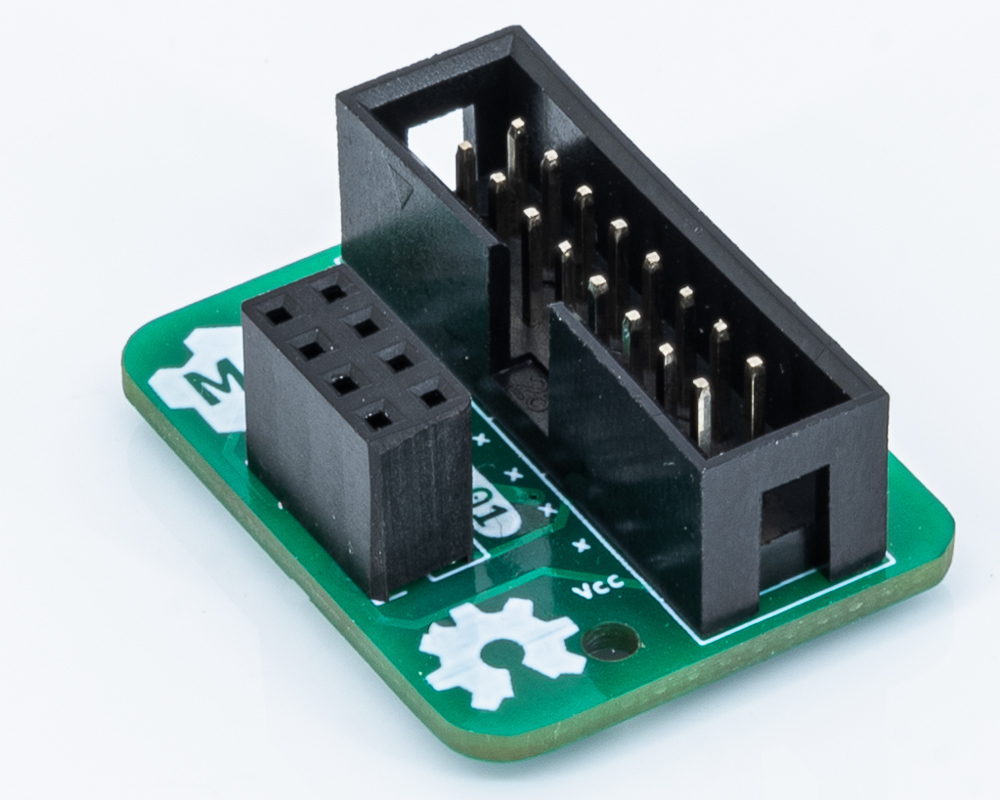
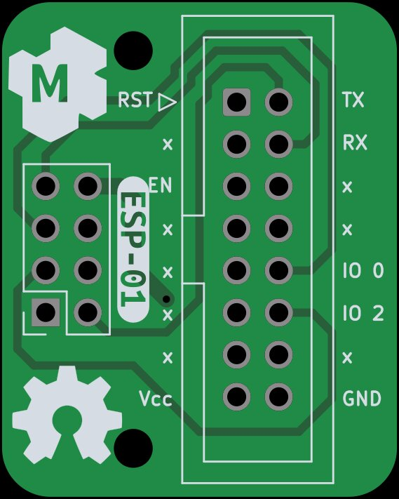
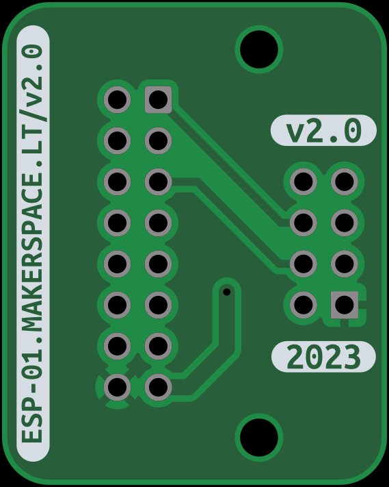
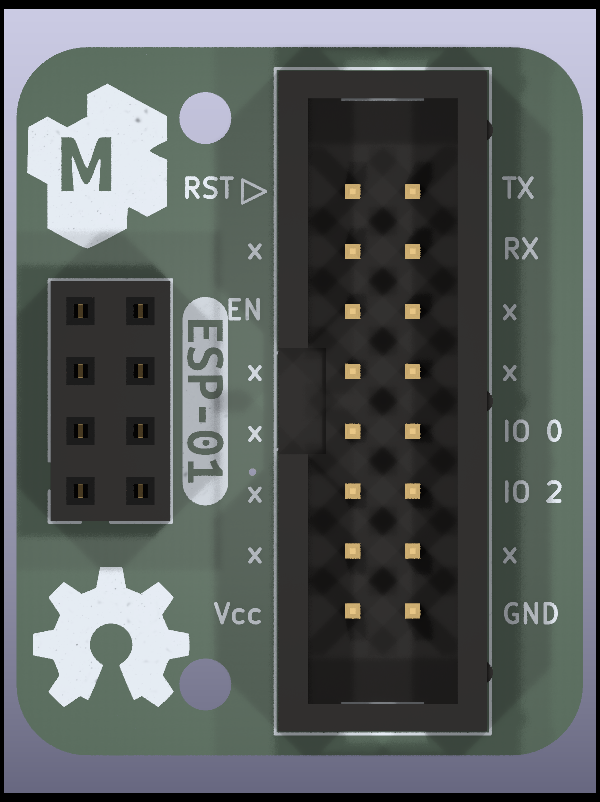

This is ESP-01 interface to connect with the [esp-flasher](http://esp-flasher.makerspace.lt/repo).

Support this open-source project - buy your fully assembled and tested device [here](http://esp-01.makerspace.lt/shop)

Dev NOTE: before commit, run `./kibot.sh` to regenerate documentation, gerbers and other assets.

* [schematics.pdf](gen/schematics.pdf)
* [pcb.pdf with dimensions](gen/pcb.pdf)

